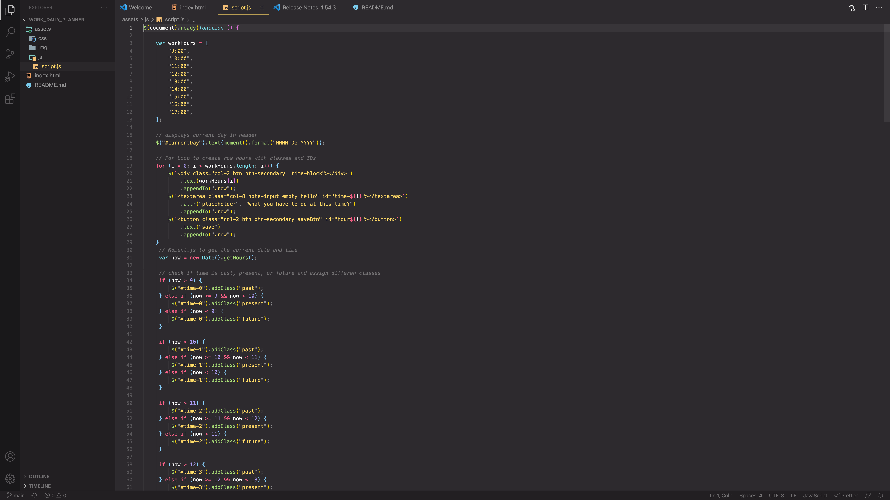

# Work_Daily_Planner

## Table of Contents

* [Description](#Description)
* [Links](#links)
* [Screenshots](#Screenshots)
* [Installation](#installation)
* [Usage](#Usage)
* [Licence](#Licence)
* [Badge](#Badge)

## Description

#### Password Generator
This application helps you to plan your daily schedule. In the header you will always find the correct today date from moment.js
Using moment.js you will ablle to determine if a certain time is in the present, past or future highlighted in differents colors.
Once you write your todo and click on save button, time and todo will be saved in local storage. At the end of the day you can 
click on reset schedule in the header to clear the local storage  and get ready for the next day plan.

## What technology has been used
* HTML
* CSS
* Javascript

## Links

* [Code Repository](https://github.com/Lloret82/Work_Daily_Planner)
* [Live website](https://lloret82.github.io/Work_Daily_Planner/)

## Screenshots

 
 

## Installation

#### _Installation not needed_

## Usage

#### _The page can be viewed in both desktop and mobile version_

## Licence

#### Copyright (c) [2021] [Andrea Di Bartolomeo]
Permission is hereby granted, free of charge, to any person obtaining a copy
of this software and associated documentation files (the "Software"), to deal
in the Software without restriction, including without limitation the rights
to use, copy, modify, merge, publish, distribute, sublicense, and/or sell
copies of the Software, and to permit persons to whom the Software is
furnished to do so, subject to the following conditions:
The above copyright notice and this permission notice shall be included in all
copies or substantial portions of the Software.
THE SOFTWARE IS PROVIDED "AS IS", WITHOUT WARRANTY OF ANY KIND, EXPRESS OR
IMPLIED, INCLUDING BUT NOT LIMITED TO THE WARRANTIES OF MERCHANTABILITY,
FITNESS FOR A PARTICULAR PURPOSE AND NONINFRINGEMENT. IN NO EVENT SHALL THE
AUTHORS OR COPYRIGHT HOLDERS BE LIABLE FOR ANY CLAIM, DAMAGES OR OTHER
LIABILITY, WHETHER IN AN ACTION OF CONTRACT, TORT OR OTHERWISE, ARISING FROM,
OUT OF OR IN CONNECTION WITH THE SOFTWARE OR THE USE OR OTHER DEALINGS IN THE
SOFTWARE_

## Badge

